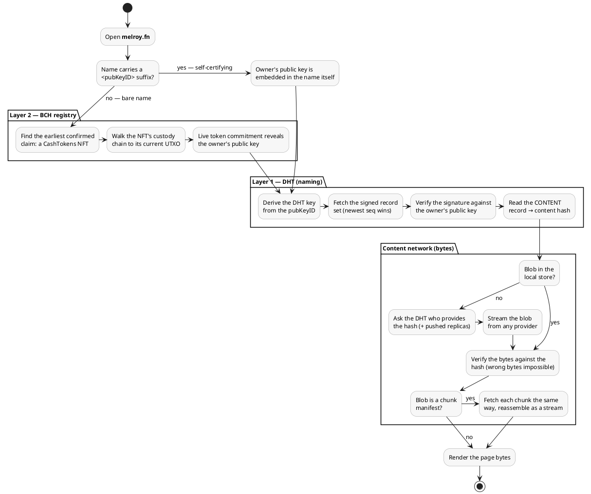

# Freedom Names

Decentralized DNS built on a libp2p Kademlia DHT, written in Go.

Freedom Names lets anyone own a human-readable name and publish DNS-style records
for it, with **no central authority**. It works in two layers:

- **Layer 1**: self-certifying `label.<pubKeyID>.fn` names, owned by whoever
  holds the matching Ed25519 keypair. Records are cryptographically signed, so
  nobody can overwrite a name they don't own, and **no consensus is needed**:
  the key *is* the name.
- **Layer 2**: globally-unique *bare* names (`mysite.fn`, no key suffix). Here
  a claim is a CashTokens NFT on **Bitcoin Cash**, and global uniqueness is
  settled by **BCH chain consensus** ("first confirmed claim wins").

Alongside both layers, a node runs a **peer-to-peer content network** so a name
can point at an actual page, not just DNS records. This is what lets Freedom
Names back a decentralized-web browser such as LibreWeb, replacing IPFS.

## How Freedom names work

A name looks like:

```
mysite.<pubKeyID>.fn
```

where `<pubKeyID>` is the base36 hash of the owner's public key (self-certifying,
like IPNS/GNS). Because the key *is* the name, squatting is impossible: no ledger
required. Records are signed `FNRecord`s stored in the DHT under a key derived
from the owner's public key; the validator verifies the signature and the
key→name binding before accepting any update, and the newest record (highest
sequence number) wins.

Globally-unique *bare* names (`mysite.fn`, no key suffix) are handled by
**Layer 2**: a claimed name is a CashTokens NFT on Bitcoin Cash, and its
uniqueness is enforced by BCH chain consensus. Resolvers all agree because they
follow the same on-chain rule: the earliest *confirmed* valid claim wins (ties
broken by smaller txid), and ownership can only move by a transaction that
actually spends the name's NFT UTXO, so metadata-only hijacks are rejected.

End to end, resolving a name (say `melroy.fn`) to page bytes looks like this —
note that no step ever addresses an IP or a server; the name commits to a key,
the key signs records, and the content's *hash* is its address:



Layer 2 defaults to BCH **mainnet**, since bare names are a real,
globally-unique namespace. A node reaches the chain through public
Electrum/Fulcrum servers: it ships with a built-in bootstrap list per network
and **fails over** between them, so no single server is a point of failure (and
you can run your own, see below). Layer 1 works without any of this.

To experiment first with free coins, point Layer 2 at a test network:

```sh
# chipnet (fast test network, faucet coins)
FREEDOM_BCH_NETWORK=chipnet go run .

# testnet4
FREEDOM_BCH_NETWORK=testnet4 go run .
```

## Running a node

```sh
go run .
```

A node runs several things at once:

- a **libp2p DHT** peer (the decentralized naming/discovery network),
- a **content network** that stores and serves page bytes peer-to-peer (a
  content-addressed blobstore + a stream protocol), so a name can point at an
  actual page, not just DNS records. This is what lets Freedom Names back a
  decentralized-web browser such as LibreWeb, replacing IPFS,
- a **DNS server** (default `:8053`) that resolves `.fn` names and forwards
  everything else upstream. Point your OS/browser at it (or bridge it to `:53`,
  see below) and `.fn` just works,
- an **HTTP API** (default `127.0.0.1:8420`) for publishing, resolving, and
  content.

Run a **bootstrap** (server) node that others can connect to:

```sh
go run . bootstrap
```

### Configuration

All configuration is via environment variables (nothing is hardcoded):

| Variable | Default | Purpose |
|---|---|---|
| `FREEDOM_HTTP_ADDR` | `:8420` | HTTP API listen address |
| `FREEDOM_DNS_ADDR` | `:8053` | DNS server listen address |
| `FREEDOM_UPSTREAM_DNS` | `1.1.1.1:53` | Upstream resolver for non-`.fn` queries |
| `FREEDOM_BOOTSTRAP` | (none) | Comma-separated bootstrap peer multiaddrs |
| `FREEDOM_CONTENT_DIR` | `~/.freedom/content` | On-disk directory for the content-addressed blobstore |
| `FREEDOM_BCH_NETWORK` | `mainnet` | BCH network for Layer 2: `mainnet`, `chipnet`, or `testnet4` |
| `FREEDOM_BCH_ELECTRUM` | (built-in list per network) | Comma-separated Electrum/Fulcrum servers, tried in order with failover (`ssl://` or `tcp://`). Overrides the built-in bootstrap list |
| `FREEDOM_BCH_MINCONF` | `1` | Confirmations required before a bare-name claim counts |

The DNS server defaults to the high port **`:8053`** so a node runs **without
root**. If the DNS port fails to bind, the node logs a warning and keeps
running; the DHT and HTTP API are unaffected.

For **system-wide** resolution your OS/browser needs Freedom Names on the
standard `:53`. Options:

- Grant the binary the capability once (recommended):
  `sudo setcap cap_net_bind_service=+ep ./freedom-names`, then run with
  `FREEDOM_DNS_ADDR=:53`.
- Or keep `:8053` and forward `:53 → :8053` with a local resolver
  (dnsmasq/systemd-resolved), or point a stub resolver at `127.0.0.1:8053`.

## Managing names with the CLI

### Layer 1: self-certifying names

```sh
# Generate an owner keypair for a name
freedom keygen mysite

# Stage one or more resource records (A | AAAA | TXT | CNAME | CONTENT)
freedom set mysite A 10.0.0.5 300
freedom set mysite TXT "hello world"

# Print your full "mysite.<pubKeyID>.fn" name
freedom name mysite

# Sign the staged records and publish them to a running node
freedom publish mysite --api http://localhost:8420

# Resolve a name via a running node
freedom lookup mysite.<pubKeyID>.fn --type A
```

Keys and staged records live under `~/.freedom/keys/`. The node's own libp2p
identity (`private.key`) is separate, so names are portable between nodes.

### Layer 2: bare names on Bitcoin Cash

These commands talk **directly to an Electrum server** (no running node needed);
they operate on a single-key BCH wallet at `~/.freedom/bch.key`. They default to
mainnet; prefix with `FREEDOM_BCH_NETWORK=chipnet` to practise with faucet coins.

```sh
# Show your BCH funding address, balance, and claimed-name (NFT) count
freedom wallet

# Claim a globally-unique bare name (mints the FN01 NFT, binds it to your key)
freedom claim mysite

# Re-bind a name NFT you already hold to your current key (e.g. after a
# plain wallet transfer moved it) so it resolves again
freedom adopt mysite

# Look up the on-chain owner of a bare name and its equivalent Layer 1 name
freedom whois mysite.fn
```

Once claimed, `mysite.fn` resolves through the same node/DNS/HTTP paths as a
Layer 1 name; the node reads the owner straight from the BCH chain.

**Privacy note:** any public Electrum server sees which bare names you resolve.
For privacy (or guaranteed availability) run your own Fulcrum and point the node
at it, which also overrides the built-in bootstrap list:

```sh
FREEDOM_BCH_ELECTRUM=ssl://your-fulcrum.example:50002 go run .
```

Invoke the CLI via the built binary (`./freedom-names freedom keygen mysite`) or,
during development, `go run . freedom keygen mysite`.

## Resolving from your system

Once a node is running, query it like any DNS server:

```sh
dig @127.0.0.1 -p 8053 mysite.<pubKeyID>.fn A
```

Non-`.fn` queries are transparently forwarded to the upstream resolver, so the
Freedom Names node can act as your system resolver.

## HTTP API

| Route | Method | Purpose |
|---|---|---|
| `/publish` | POST | Store a signed `FNRecord` (JSON body) |
| `/resolve?name=<name>&type=<TYPE>` | GET | Resolve a name to its records |
| `/record?name=<name>` | GET | Fetch the raw signed record (includes seq and expiry) |
| `/content` | POST/GET | Store page bytes (`POST`) or fetch by `?hash=` (`GET`) |
| `/resolve-content?name=<name>` | GET | Resolve a name to its `CONTENT` bytes in one call |
| `/peers` | GET | Routing-table peers + connected hosts |
| `/info` | GET | Version, mode, peer ID, addresses, network size |
| `/health` | GET | Liveness + version handshake |
| `/clear_cache` | DELETE | Purge the local resolution cache |

Content responses (`/content` GET and `/resolve-content`) carry a `Content-Type`
header sniffed from the first bytes (e.g. `image/png`, `text/plain`), since the
content-addressed store keeps no MIME metadata. Unrecognized bytes fall back to
`application/octet-stream`.

## Development

Run tests (including a live over-the-wire DNS server test):

```sh
go test -race ./...
```

Install [air](https://github.com/air-verse/air) for auto-recompile on changes:

```sh
air
```

## Troubleshooting

To avoid QUIC receive-buffer warnings, increase the kernel limits:

```sh
sudo sysctl -w net.core.rmem_max=7500000
sudo sysctl -w net.core.wmem_max=7500000
```

Make it permanent in `/etc/sysctl.conf`:

```conf
net.core.rmem_max=7500000
net.core.wmem_max=7500000
```
